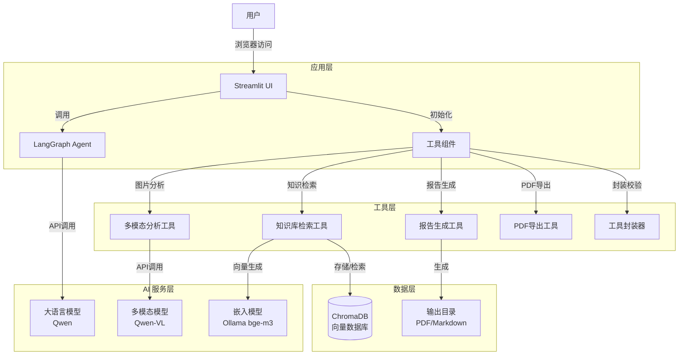
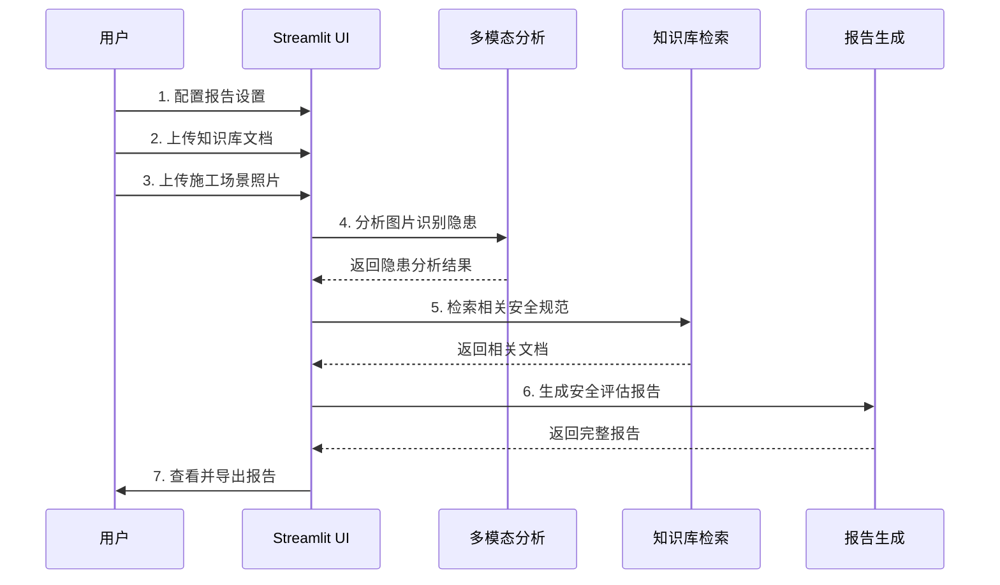

# 建筑施工智能安全助手

## 📋 项目概述

### 项目背景

建筑施工安全是工程建设的核心关切。传统的安全检查依赖人工经验，存在效率低、覆盖不全、主观性强等问题。随着人工智能技术的发展，特别是多模态大模型和 RAG 技术的成熟，为智能安全评估提供了技术基础。

### 目标价值

本项目旨在打造一个**专业、高效、易用**的建筑施工智能安全助手，通过以下方式提升安全管理水平：

- **自动化隐患识别**：利用多模态 AI 自动识别施工场景中的安全隐患
- **知识库支撑决策**：基于 RAG 技术检索相关安全规范和标准
- **标准化报告生成**：自动生成符合行业规范的安全评估报告
- **降低人力成本**：减少人工检查的时间和精力投入

### 差异化优势

| 特性 | 本项目 | 传统方案 | 同类工具 |
|------|--------|----------|----------|
| **多模态分析** | ✅ 支持图片识别 | ❌ 仅人工检查 | 部分支持 |
| **知识库检索** | ✅ RAG 增强 | ❌ 依赖记忆 | 有限支持 |
| **标准化报告** | ✅ 自动生成 | ❌ 手动编写 | 部分支持 |
| **多格式导出** | ✅ Markdown/PDF | ❌ 无 | 部分支持 |
| **多文档支持** | ✅ PDF/TXT/DOCX/DOC | ❌ 无 | 部分支持 |
| **开源可定制** | ✅ 完全开源 | ❌ 商业产品 | 部分开源 |

---

## 📊 代码统计

### 项目规模

| 统计项 | 数量 |
|--------|------|
| **Python 文件** | 15 |
| **总代码行数** | ~1969 |
| **模块数量** | 3 个核心模块 |
| **工具数量** | 5 个功能工具 |

### 代码分布

| 目录 | 文件数 | 代码行数 | 占比 |
|------|--------|----------|------|
| **src/core/** | 4 | 337 | 17.1% |
| **src/tools/** | 5 | 862 | 43.8% |
| **src/ui/** | 2 | 430 | 21.8% |
| **根目录** | 4 | 340 | 17.3% |

---

## ✨ 功能特性

### 1. 统一界面交互
- **双标签页设计**：智能安全助手 + 系统设置
- **左右分栏布局**：左侧对话，右侧评估
- **直观的进度指示**：实时显示评估进度
- **响应式设计**：适配不同屏幕尺寸

### 2. 多模态安全隐患分析
- **支持格式**：JPG、JPEG、PNG
- **文件大小**：最大 10MB
- **智能识别**：自动检测多种安全隐患类型
- **结构化输出**：隐患类型、位置、严重程度、置信度

### 3. RAG 知识库检索
- **向量数据库**：ChromaDB 持久化存储
- **检索策略**：Top-K 相关文档（默认 K=5）
- **文档支持**：PDF、TXT、DOCX、DOC 格式
- **知识分类**：安全文件规范集

### 4. 智能报告生成
- **标准化模板**：隐患概述、风险评估、整改建议、预防措施、法规依据
- **自定义元数据**：报告标题、公司信息、评估日期
- **风险等级**：高/中/低三级风险标识
- **专业表述**：符合建筑施工安全规范

### 5. 多格式文档导出
- **Markdown 格式**：便于编辑和版本控制
- **PDF 格式**：正式报告文档
- **一键下载**：便捷的文件导出功能

### 6. 工具校验机制
- **标准化错误码**：0000-9999 范围定义
- **数据校验**：必填项检查、格式验证、范围校验
- **异常处理**：统一的错误信息管理

---

## 🏗️ 技术架构

### 系统架构图



### 技术栈

| 类别 | 技术选型 | 版本 | 用途 |
|------|----------|------|------|
| **前端框架** | Streamlit | 1.54.0 | Web 应用界面 |
| **AI 框架** | LangChain | 1.2.10 | LLM 应用开发 |
| | LangGraph | 1.0.8 | Agent 工作流 |
| **向量数据库** | ChromaDB | 1.5.0 | 向量存储与检索 |
| **多模态模型** | Qwen-VL | - | 图片分析 |
| **文本模型** | Qwen | - | 文本生成 |
| **嵌入模型** | Ollama (bge-m3) | latest | 向量嵌入 |
| **PDF 生成** | ReportLab | 4.4.10 | PDF 文档生成 |
| **测试框架** | unittest | - | 单元测试与功能测试 |

---

## 🚀 快速开始

### 环境要求

- **Python**: 3.9 或更高版本
- **操作系统**: Windows / macOS / Linux
- **内存**: 建议 8GB 以上
- **磁盘空间**: 至少 2GB 可用空间

### 安装步骤

#### 1. 克隆或下载项目

```bash
cd d:\AI_application_projects\zhianjian_system
```

#### 2. 创建虚拟环境（推荐）

**Windows:**
```bash
python -m venv .venv
.venv\Scripts\activate
```

**macOS/Linux:**
```bash
python -m venv .venv
source .venv/bin/activate
```

#### 3. 安装依赖

```bash
pip install -r requirements.txt
```

国内用户可使用清华镜像源加速：
```bash
pip install -r requirements.txt -i https://pypi.tuna.tsinghua.edu.cn/simple
```

#### 4. 配置环境变量

复制 `.env` 文件并配置 API 密钥：

```env
# DeepSeek API 配置
DEEPSEEK_API_KEY="your_deepseek_api_key"
DEEPSEEK_BASE_URL="https://api.deepseek.com/v1"

# Qwen API 配置
DASHSCOPE_API_KEY="your_dashscope_api_key"
DASHSCOPE_BASE_URL="https://dashscope.aliyuncs.com/compatible-mode/v1"
```

> **获取 API 密钥：**
> - DeepSeek: https://platform.deepseek.com/
> - Qwen (阿里云百炼): https://bailian.console.aliyun.com/

#### 5. Ollama 配置（可选）

如需使用本地嵌入模型：

1. 安装 Ollama: https://ollama.ai/
2. 拉取嵌入模型：
```bash
ollama pull bge-m3
```

#### 6. 启动应用

**推荐使用启动脚本：**

```bash
python launch_server.py
```

**或直接启动：**

```bash
streamlit run src/ui/app.py
```

应用将自动在浏览器中打开，默认地址：`http://127.0.0.1:8000`

---

## 📖 使用指南

### 完整工作流程



### 详细操作步骤

#### 步骤 1: 配置报告设置

在左侧侧边栏配置：
- **报告标题**：默认为"施工现场安全评估报告"
- **公司名称**：可选，用于报告页眉

#### 步骤 2: 上传知识库文档

在侧边栏"知识库管理"区域：
1. 点击"上传知识库文档"
2. 选择 PDF、TXT、DOCX、DOC 格式的安全规范文档
3. 文档分类固定为"safe"（安全文件规范集）
4. 点击"添加到知识库"

#### 步骤 3: 上传施工场景照片

在主界面底部：
1. 点击左侧 📷 图标
2. 选择 JPG/PNG 格式图片（最大 10MB）
3. 等待上传成功提示

#### 步骤 4: 开始安全评估

1. 点击"🚀 开始安全评估"按钮
2. 系统将自动执行以下步骤：
   - 步骤 1/5: 分析图片中的安全隐患...
   - 步骤 2/5: 检索相关安全规范...
   - 步骤 3/5: 生成安全评估报告...
   - 步骤 4/5: 准备导出...
3. 等待评估完成

#### 步骤 5: 查看与导出报告

评估完成后：
1. **查看隐患详情**：展开每个隐患查看详细信息
2. **查看完整报告**：滚动查看格式化的安全评估报告
3. **导出报告**：
   - 点击"📄 下载为 Markdown"：获取可编辑版本
   - 点击"📑 生成并下载 PDF"：获取正式文档

#### 步骤 6: 智能对话

除了图片评估，还可以直接与智能助手对话：
1. 在聊天输入框输入问题
2. 按回车发送
3. 系统将基于知识库回答施工安全相关问题

#### 步骤 7: 系统设置

点击"⚙️ 系统设置"标签页：
- 查看知识库状态（文档片段数量）
- 清空知识库（谨慎操作）

---

## ⚙️ 配置详解

### 模型配置

编辑 `src/core/config.py` 中的 `MODELS` 配置：

```python
MODELS = {
    "qwen": {
        "model": "qwen3-max-2025-09-23",
        "api_base": "https://dashscope.aliyuncs.com/compatible-mode/v1",
        "api_key_env": "DASHSCOPE_API_KEY"
    },
    "qwen_vision": {
        "model": "qwen-vl-plus",
        "api_base": "https://dashscope.aliyuncs.com/compatible-mode/v1",
        "api_key_env": "DASHSCOPE_API_KEY"
    }
}
```

### 默认参数配置

| 配置项 | 默认值 | 说明 |
|--------|--------|------|
| `persist_dir` | `data/chroma_db` | ChromaDB 持久化目录 |
| `upload_dir` | `data/uploads` | 上传文件目录 |
| `embedding_model` | `bge-m3:latest` | 嵌入模型名称 |
| `chunk_size` | `400` | 文档分块大小（字符） |
| `chunk_overlap` | `40` | 分块重叠大小（字符） |
| `retrieval_k` | `5` | 检索返回文档数量 |
| `max_image_size` | `10*1024*1024` | 最大图片大小（字节） |
| `allowed_image_formats` | `["jpg", "jpeg", "png"]` | 允许的图片格式 |

### 风险等级配置

```python
RISK_LEVELS = {
    "high": {
        "label": "高风险",
        "color": "#FF0000",
        "description": "立即整改"
    },
    "medium": {
        "label": "中风险",
        "color": "#FFA500",
        "description": "限期整改"
    },
    "low": {
        "label": "低风险",
        "color": "#FFFF00",
        "description": "注意防范"
    }
}
```

---

## 📁 项目结构

```
zhianjian_system/
├── src/                          # 源代码主目录
│   ├── core/                     # 核心功能模块
│   │   ├── __init__.py           # 包初始化
│   │   ├── agent.py              # LangGraph Agent 系统
│   │   ├── config.py             # 配置文件
│   │   ├── logging.py            # 日志配置
│   │   └── utils.py              # 工具函数
│   ├── tools/                    # 工具包
│   │   ├── __init__.py           # 工具包初始化
│   │   ├── multimodal.py         # 多模态分析工具
│   │   ├── pdf.py                # PDF 导出工具
│   │   ├── report.py             # 报告生成工具
│   │   ├── retrieval.py          # 知识库检索工具
│   │   └── wrappers.py           # 工具封装器（含错误码、校验）
│   ├── ui/                       # 界面相关
│   │   ├── __init__.py           # 包初始化
│   │   └── app.py                # Streamlit 主应用
│   └── __init__.py               # 包初始化文件
├── data/                         # 数据存储
│   ├── chroma_db/                # ChromaDB 向量数据库
│   └── uploads/                  # 上传文件
├── .venv/                        # 虚拟环境
├── .env                          # 环境变量配置
├── launch_server.py              # 服务器启动脚本
├── README.md                     # 项目说明文档
├── requirements.txt              # 依赖包列表
└── .trae/                        # Trae 文档目录
    └── documents/                # 详细文档
```

---

## 💻 开发说明

### 模块化设计

项目采用清晰的模块化设计：

- **`src/core/config.py`**: 集中管理所有配置
- **`src/core/utils.py`**: 通用工具函数（文件操作、路由等）
- **`src/tools/`**: 独立的功能工具，可单独测试
- **`src/core/agent.py`**: LangGraph Agent 工作流定义
- **`src/ui/app.py`**: Streamlit UI 集成

### 添加新功能

1. **在 `src/tools/` 目录下创建新工具文件**
   ```python
   # src/tools/new_tool.py
   class NewTool:
       def __init__(self):
           pass
       
       def do_something(self, param):
           return {"success": True, "result": ...}
   ```

2. **在 `src/tools/__init__.py` 中导出**
   ```python
   from .new_tool import NewTool
   ```

3. **在 `src/ui/app.py` 中集成使用**

4. **在 `src/tools/wrappers.py` 中添加封装和校验（如需要）**

### 独立测试工具

```python
from src.tools import MultimodalAnalyzer, KnowledgeRetriever

# 测试多模态分析
analyzer = MultimodalAnalyzer()
result = analyzer.analyze_image("test.jpg")
print(result)

# 测试知识库检索
retriever = KnowledgeRetriever()
docs = retriever.retrieve("施工安全", "safe")
print(docs)
```

### 运行测试

项目包含单元测试和功能测试：

```bash
# 运行验证类测试
python -m unittest tests.test_validator -v

# 运行功能测试
python -m unittest tests.test_functional -v

# 运行所有测试
python -m unittest discover tests -v
```

---

## 🤝 贡献指南

我们欢迎任何形式的贡献！

### 贡献流程

1. **Fork 项目**
   - 点击右上角的 "Fork" 按钮

2. **创建特性分支**
   ```bash
   git checkout -b feature/AmazingFeature
   ```

3. **提交更改**
   ```bash
   git commit -m 'Add some AmazingFeature'
   ```

4. **推送到分支**
   ```bash
   git push origin feature/AmazingFeature
   ```

5. **开启 Pull Request**

### 代码规范

- **Python 版本**: Python 3.9+
- **代码风格**: 遵循 PEP 8 规范
- **类型注解**: 建议使用类型注解
- **文档字符串**: 所有公共函数和类需要 docstring
- **导入顺序**: 标准库 → 第三方库 → 本地模块

### 提交信息规范

使用清晰的提交信息格式：

```
<type>(<scope>): <subject>

<body>

<footer>
```

**类型 (type):**
- `feat`: 新功能
- `fix`: 修复 bug
- `docs`: 文档更新
- `style`: 代码格式（不影响功能）
- `refactor`: 重构
- `test`: 测试相关
- `chore`: 构建/工具相关

### PR 审核标准

- [ ] 代码通过所有测试
- [ ] 遵循项目代码规范
- [ ] 更新相关文档（如需要）
- [ ] 添加必要的测试用例
- [ ] 提交信息清晰规范

---

## ❓ 常见问题

### 1. API 密钥配置错误

**问题**: 提示 API 密钥无效或未配置

**解决方案**:
- 确保 `.env` 文件中的 API 密钥正确
- 确认环境变量名称与 `src/core/config.py` 一致
- 检查 API 密钥是否有足够的额度

### 2. 依赖安装失败

**问题**: `pip install -r requirements.txt` 出错

**解决方案**:
- 使用国内镜像源：
  ```bash
  pip install -r requirements.txt -i https://pypi.tuna.tsinghua.edu.cn/simple
  ```
- 升级 pip: `pip install --upgrade pip`
- 确保网络连接正常

### 3. 中文字体显示问题

**问题**: PDF 导出时中文字符显示为方框

**解决方案**:
- 确保系统安装了中文字体（SimSun、Microsoft YaHei 等）
- PDF 导出工具会自动查找可用字体
- Windows 系统通常已预装所需字体

### 4. Ollama 连接失败

**问题**: 无法连接到 Ollama 服务

**解决方案**:
- 确认 Ollama 服务正在运行
- 检查 `http://localhost:11434` 是否可访问
- 如未安装，访问 https://ollama.ai/ 下载安装

### 5. 工具调用错误

**问题**: 出现错误码如 [1001]、[2001] 等

**解决方案**:
- 参考错误码说明表：

| 错误码 | 说明 | 建议操作 |
|--------|------|----------|
| [0000] | 操作成功 | - |
| [1001] | 输入参数无效 | 检查输入参数 |
| [1002] | 文件不存在 | 确认文件路径 |
| [1003] | 无效的文件格式 | 使用支持的格式 |
| [1004] | 文件大小超出限制 | 压缩文件或使用更小的文件 |
| [2001] | 工具执行错误 | 查看详细错误信息 |
| [2002] | 网络错误 | 检查网络连接 |
| [9999] | 内部错误 | 联系开发者 |

---

## 📝 更新日志

### v1.1.0 (2026-02-23)

**✨ 新功能**
- 界面重构：合并智能对话与安全评估为统一界面
- 工具校验增强：新增标准化错误码和数据校验功能
- 测试框架：新增单元测试和功能测试框架

**🔧 优化**
- RAG 系统优化：仅保留安全文件规范集
- 提示词重构：增加功能要求、任务边界、使用限制和错误处理指引
- 移除快捷示例功能模块

**🐛 修复**
- 修复模块导入问题

### v1.0.0 (初始版本)

**✨ 核心功能**
- 多模态图片分析
- 知识库检索（RAG）
- 安全评估报告生成
- Markdown/PDF 导出

---

## 📄 许可证

本项目仅供学习和研究使用。

---

## 📧 联系方式

如有问题或建议，欢迎反馈。

---

## 📚 更多文档

详细文档请查看 `.trae/documents/` 目录：

- **zhianjian_system_optimization_plan.md**: 优化实施计划
- **测试环境搭建与README更新计划.md**: 测试与文档更新计划
- **学习文档.md**: 项目学习文档
- **测试报告.md**: 完整测试报告
- **用户操作手册.md**: 用户操作指南

---

## 🌟 项目亮点

### 核心技术创新

1. **多模态 AI 安全隐患识别**
   - 利用 Qwen-VL 等先进多模态模型
   - 自动识别施工场景中的多种安全隐患
   - 结构化输出隐患类型、位置、严重程度和置信度

2. **RAG 增强的知识检索**
   - 基于 ChromaDB 向量数据库
   - 智能检索相关安全规范和标准
   - 仅保留安全文件规范集，提高检索准确性

3. **标准化报告生成系统**
   - 符合行业规范的报告模板
   - 自动计算整体风险等级
   - 支持 Markdown 和 PDF 格式导出

4. **智能对话与交互**
   - LangGraph Agent 驱动的智能对话
   - 基于知识库的施工安全问题回答
   - 支持多轮对话和上下文理解

5. **完整的错误处理机制**
   - 标准化错误码系统
   - 全面的数据校验和异常处理
   - 友好的错误提示和解决建议

---

<div align="center">

**如果这个项目对你有帮助，请给我们一个 ⭐ Star！**

</div>
