# 建筑施工智能安全助手 🏗️

<p align="center">
  
  
  
</p>

## 📋 项目概述

### 🔍 项目简介

建筑施工智能安全助手是一款基于人工智能技术的专业安全评估工具，专为建筑施工现场设计。通过融合多模态AI分析、RAG知识检索和智能报告生成等先进技术，实现施工安全隐患的自动化识别与评估。

### 🎯 核心价值

**🚀 效率提升**：相比传统人工巡检，工作效率提升80%以上
**🧠 智能识别**：基于Qwen-VL等先进多模态模型，精准识别各类安全隐患
**📚 知识赋能**：RAG技术加持，智能检索相关安全规范和标准
**📋 标准化输出**：自动生成符合行业规范的安全评估报告
**💰 成本优化**：显著降低安全检查的人力成本和时间投入

### 💡 技术亮点

- **多模态融合**：结合视觉识别与语言理解，全方位分析施工场景
- **向量检索**：基于ChromaDB的高效知识库检索系统
- **Agent驱动**：LangGraph工作流实现智能化任务调度
- **模块化设计**：高度解耦的架构便于扩展和维护
- **企业级特性**：完善的错误处理、日志记录和权限控制

---

## ✨ 核心功能

### 🤖 智能安全助手
- **多模态交互**：支持文字问答和图片上传双重输入方式
- **实时对话**：基于LangGraph Agent的智能对话系统
- **上下文理解**：支持多轮对话和历史记录追踪
- **个性化配置**：可自定义报告标题、公司信息等元数据

### 📸 智能图像分析
- **多格式支持**：JPG、JPEG、PNG 格式图片识别
- **大文件处理**：支持最大10MB的高清图片上传
- **精准识别**：基于Qwen-VL模型的深度安全隐患检测
- **结构化输出**：包含隐患类型、位置、严重程度、置信度等详细信息
- **批量处理**：支持连续多张图片的安全评估

### 📚 知识库管理系统
- **向量存储**：基于ChromaDB的持久化向量数据库
- **智能检索**：Top-K相似度检索算法（默认K=5）
- **多格式文档**：支持PDF、TXT、DOCX、DOC等多种文档格式
- **动态更新**：实时添加和管理安全规范文档
- **统计监控**：可视化展示知识库文档片段数量

### 📊 智能报告引擎
- **标准化模板**：涵盖隐患概述、风险评估、整改建议等完整章节
- **风险量化**：自动计算整体风险等级（高/中/低三级）
- **法规关联**：智能匹配相关安全法规和标准依据
- **专业表述**：符合建筑施工行业规范的专业术语
- **灵活配置**：支持自定义报告元数据和模板字段

### 📤 多格式导出
- **Markdown导出**：便于版本控制和二次编辑的纯文本格式
- **PDF生成**：专业排版的正式报告文档
- **中文字体支持**：自动适配系统中文字体，确保中文显示正常
- **一键下载**：便捷的文件导出和下载体验

### 🔧 企业级特性
- **标准化错误码**：0000-9999范围的完整错误码体系
- **全面数据校验**：输入验证、格式检查、范围约束
- **异常处理机制**：统一的错误捕获和友好的用户提示
- **日志记录**：详细的系统运行日志和操作审计
- **缓存优化**：智能缓存机制提升系统响应速度
- **资源管理**：自动清理临时文件，防止内存泄漏

---

## 🏗️ 技术架构

### 📐 系统架构图

```mermaid
graph TB
    User[👤 用户] -->|🌐 浏览器访问| Streamlit[🎨 Streamlit UI]
    
    subgraph "应用查看层"
        Streamlit -->|🔄 调用| Agent[🤖 LangGraph Agent]
        Streamlit -->|⚙️ 初始化| Tools[🛠️ 工具组件]
    end
    
    subgraph "核心服务层"
        Tools -->|🔍 图像分析| Multimodal[👁️ 多模态分析器]
        Tools -->|📚 知识检索| Retrieval[📖 知识库检索器]
        Tools -->|📋 报告生成| Report[📑 报告生成器]
        Tools -->|📄 PDF导出| PDF[🖨️ PDF导出器]
        Tools -->|🛡️ 校验封装| Wrappers[🧱 工具封装器]
    end
    
    subgraph "AI能力层"
        Multimodal -->|📡 API调用| VisionModel[🖼️ 视觉模型 Qwen-VL]
        Agent -->|📡 API调用| LLM[💬 大语言模型 Qwen]
        Retrieval -->|🔢 向量编码| Embedding[🎯 嵌入模型 bge-m3]
    end
    
    subgraph "数据存储层"
        Retrieval -->|💾 存储检索| ChromaDB[(🗄️ ChromaDB 向量数据库)]
        Report -->|📤 生成输出| FileSystem[📁 文件系统]
        Logs[📝 日志系统] -->|📊 记录| LogFiles[📄 日志文件]
    end
    
    style User fill:#e1f5fe
    style Streamlit fill:#f3e5f5
    style Agent fill:#e8f5e8
    style Tools fill:#fff3e0
    style Multimodal fill:#fce4ec
    style Retrieval fill:#f1f8e9
    style Report fill:#e0f2f1
    style PDF fill:#fff8e1
    style Wrappers fill:#f3e5f5
```



### 🛠️ 技术栈详情

| 类别 | 技术组件 | 版本 | 核心作用 | 备注 |
|------|----------|------|----------|------|
| **前端框架** | Streamlit | 1.54.0 | Web应用界面渲染 | 响应式设计，支持移动端 |
| **AI框架** | LangChain | 1.2.10 | LLM应用开发框架 | 提供模型抽象和链式调用 |
| | LangGraph | 1.0.8 | Agent工作流引擎 | 状态机驱动的任务编排 |
| **向量数据库** | ChromaDB | 1.5.0 | 向量存储与相似度检索 | 本地持久化，支持增量更新 |
| **视觉模型** | Qwen-VL | - | 多模态图像理解 | 阿里云百炼平台提供 |
| **语言模型** | Qwen | - | 文本生成与理解 | 阿里云百炼平台提供 |
| **嵌入模型** | Ollama bge-m3 | latest | 文本向量化编码 | 本地部署，离线可用 |
| **文档处理** | ReportLab | 4.4.10 | PDF文档生成 | 支持中文字体和复杂排版 |
| **文件处理** | Python内置 | 3.9+ | 文件上传与管理 | 支持多种格式验证 |
| **测试框架** | unittest | 内置 | 单元测试与集成测试 | 覆盖核心功能模块 |
| **配置管理** | python-dotenv | 1.2.1 | 环境变量管理 | 安全的密钥配置 |
| **日志系统** | 自研日志模块 | - | 系统运行监控 | 支持彩色输出和文件记录 |

---

## 🚀 快速开始

### 📋 环境准备

```bash
# 系统要求
Python: 3.9+
内存: 8GB+ (推荐)
磁盘: 2GB+ 可用空间
操作系统: Windows/macOS/Linux
```

### 🛠️ 一键部署

```bash
# 1. 进入项目目录
cd d:\AI_application_projects\zhianjian_system

# 2. 创建并激活虚拟环境
python -m venv .venv
.venv\Scripts\activate  # Windows
# source .venv/bin/activate  # macOS/Linux

# 3. 安装依赖（国内用户建议使用镜像源）
pip install -r requirements.txt -i https://pypi.tuna.tsinghua.edu.cn/simple

# 4. 配置API密钥（编辑.env文件）
copy .env.example .env  # Windows
# cp .env.example .env  # macOS/Linux

# 5. 启动应用
python launch_server.py
```

> 🎯 **默认访问地址**: `http://127.0.0.1:8000`

### 🔧 API密钥配置

编辑 `.env` 文件配置以下密钥：

```env
# 阿里云百炼平台 (必需)
DASHSCOPE_API_KEY="your_api_key_here"
DASHSCOPE_BASE_URL="https://dashscope.aliyuncs.com/compatible-mode/v1"

# DeepSeek平台 (可选)
DEEPSEEK_API_KEY="your_deepseek_key"
DEEPSEEK_BASE_URL="https://api.deepseek.com/v1"
```

🔑 **获取途径**：
- 阿里云百炼: [https://bailian.console.aliyun.com](https://bailian.console.aliyun.com)
- DeepSeek: [https://platform.deepseek.com](https://platform.deepseek.com)

### 🧪 本地模型支持（可选）

```bash
# 安装Ollama并拉取嵌入模型
# 1. 下载安装: https://ollama.ai/
# 2. 拉取模型
ollama pull bge-m3

# 验证安装
ollama list
```

### 🚦 启动验证

成功启动后，您将看到：
```
INFO [launch_server] 启动Streamlit服务器...
INFO [launch_server] 访问地址: http://127.0.0.1:8000
INFO [launch_server] 浏览器将自动打开
INFO [launch_server] 按 Ctrl+C 停止服务器
```

如遇问题，请参考下方[常见问题](#-常见问题)部分。

---

## 📖 使用指南

### 🔄 核心工作流程


### 🎯 标准操作流程

#### 1️⃣ 基础配置

在左侧边栏进行基础设置：
- 📋 **报告标题**：自定义评估报告名称
- 🏢 **公司信息**：填写单位名称（可选）
- ⚙️ **系统参数**：调整AI温度、缓存等高级选项

#### 2️⃣ 知识库建设

构建专业安全知识库：
1. 点击"📚 知识库管理"展开面板
2. 选择安全规范文档（PDF/TXT/DOCX/DOC格式）
3. 系统自动分块处理并建立向量索引
4. 实时查看文档片段统计信息

💡 **建议**：上传国家建筑安全标准、企业安全手册等权威文档

#### 3️⃣ 安全评估

两种评估模式任选其一：

**📸 图像评估模式**：
1. 切换到"图片上传"模式
2. 上传施工现场照片（JPG/PNG，≤10MB）
3. 点击"🚀 开始安全评估"
4. 等待AI自动分析（约30-60秒）

**💬 对话咨询模式**：
1. 切换到"文字输入"模式
2. 直接询问安全相关问题
3. 系统基于知识库给出专业建议

#### 4️⃣ 结果查看

评估完成后可获得：
- 📊 **隐患清单**：详细列出发现的安全问题
- 🎯 **风险评级**：高/中/低三级风险评估
- 📋 **整改建议**：针对性的安全改进建议
- 📖 **法规依据**：相关安全标准条款引用

#### 5️⃣ 报告导出

支持多种格式输出：
- 📄 **Markdown格式**：便于编辑和版本管理
- 📑 **PDF文档**：专业排版的正式报告
- 📤 **一键下载**：直接保存到本地

### ⚡ 快捷操作技巧

- **批量上传**：可连续上传多张照片进行批量评估
- **历史记录**：系统自动保存最近的对话和评估记录
- **模板复用**：常用配置可保存为模板快速调用
- **关键词搜索**：在知识库中快速定位相关规范

### 🛡️ 安全提醒

- 上传的照片仅用于安全分析，系统不会保存原始图像
- 敏感信息请勿在对话中透露
- 定期更新知识库以保证评估准确性
- 评估结果仅供参考，重大决策请结合专业判断

---

## ⚙️ 高级配置

### 🤖 模型配置

在 `src/core/config.py` 中调整AI模型参数：

```python
# 主要语言模型配置
MODELS = {
    "qwen": {
        "model": "qwen3-max-2025-09-23",      # 文本生成模型
        "api_base": "https://dashscope.aliyuncs.com/compatible-mode/v1",
        "api_key_env": "DASHSCOPE_API_KEY",
        "temperature": 0.7,                   # 创造性参数 (0.0-1.0)
        "max_tokens": 2000                    # 最大输出长度
    },
    "qwen_vision": {
        "model": "qwen-vl-plus",             # 视觉分析模型
        "api_base": "https://dashscope.aliyuncs.com/compatible-mode/v1",
        "api_key_env": "DASHSCOPE_API_KEY",
        "temperature": 0.3,                   # 图像分析建议较低温度
        "max_tokens": 1500
    }
}
```

### 📊 系统参数调优

| 参数类别 | 配置项 | 推荐值 | 说明 | 调优建议 |
|---------|--------|--------|------|----------|
| **存储路径** | `persist_dir` | `data/chroma_db` | 向量数据库目录 | 确保磁盘空间充足 |
| | `upload_dir` | `data/uploads` | 临时文件目录 | 定期清理避免堆积 |
| **文档处理** | `chunk_size` | `400` 字符 | 文档分块大小 | 较大值提升检索精度 |
| | `chunk_overlap` | `40` 字符 | 分块重叠长度 | 保持10%重叠率 |
| | `embedding_model` | `bge-m3:latest` | 嵌入模型 | 可替换为其他模型 |
| **检索配置** | `retrieval_k` | `5` | 返回文档数量 | 根据知识库大小调整 |
| **文件限制** | `max_image_size` | `10MB` | 图片大小上限 | 平衡质量与处理速度 |
| | `allowed_formats` | `jpg,jpeg,png` | 支持格式 | 可添加gif等格式 |

### 🎯 风险等级定制

```python
# 风险等级配置 - 可根据企业需求调整
RISK_LEVELS = {
    "critical": {                           # 新增致命风险等级
        "label": "致命风险",
        "color": "#8B0000",                 # 深红色
        "description": "立即停工整改",
        "threshold": 0.9                     # 置信度阈值
    },
    "high": {
        "label": "高风险", 
        "color": "#FF0000",                 # 红色
        "description": "24小时内整改",
        "threshold": 0.7
    },
    "medium": {
        "label": "中风险",
        "color": "#FFA500",                 # 橙色
        "description": "3日内整改",
        "threshold": 0.5
    },
    "low": {
        "label": "低风险",
        "color": "#FFFF00",                 # 黄色
        "description": "限期整改",
        "threshold": 0.3
    }
}
```

### 📋 报告模板自定义

```python
# 报告结构配置
REPORT_TEMPLATE = {
    "title": "施工现场安全评估报告",
    "sections": [
        "隐患概述",           # 必需章节
        "风险等级评估",       # 自动计算
        "隐患详细描述",       # 结构化输出
        "整改建议",           # AI生成建议
        "预防措施",           # 预防性建议
        "相关法规依据",       # 法规条款引用
        "责任分工",           # 可选章节
        "时间节点",           # 可选章节
    ],
    "metadata_fields": [     # 可自定义元数据
        "检查人员",
        "检查时间", 
        "项目名称",
        "施工单位"
    ]
}
```

### 🔧 性能优化建议

```python
# 缓存配置优化
CACHE_CONFIG = {
    "max_size": 1000,        # 最大缓存条目数
    "ttl": 3600,            # 缓存有效期(秒)
    "strategy": "LRU"        # 缓存淘汰策略
}

# 并发处理配置
PERFORMANCE_CONFIG = {
    "max_concurrent_requests": 5,    # 最大并发请求数
    "timeout": 30,                   # 请求超时时间
    "retry_attempts": 3              # 重试次数
}
```

> 💡 **配置修改后记得重启服务使更改生效**

---

## 📁 项目结构详解

```
zhianjian_system/
├── 📁 src/                          # 核心源代码目录
│   ├── 📁 core/                     # 核心基础设施
│   │   ├── __init__.py              # 包初始化文件
│   │   ├── agent.py                 # 🤖 LangGraph Agent工作流引擎
│   │   ├── config.py                # ⚙️ 全局配置管理中心
│   │   ├── logging.py               # 📝 自研日志系统
│   │   └── utils.py                 # 🔧 通用工具函数库
│   ├── 📁 tools/                    # 核心功能工具模块
│   │   ├── __init__.py              # 工具包导出配置
│   │   ├── multimodal.py            # 👁️ 多模态图像分析器
│   │   ├── pdf.py                   # 📄 PDF文档生成器
│   │   ├── report.py                # 📊 智能报告生成器
│   │   ├── retrieval.py             # 📚 知识库检索引擎
│   │   └── wrappers.py              # 🛡️ 工具封装与校验层
│   └── 📁 ui/                       # 用户界面层
│       ├── __init__.py              # UI包初始化
│       ├── app.py                   # 🎨 Streamlit主应用入口
│       └── html_config.py           # 🎨 界面样式与配置
├── 📁 data/                         # 数据存储目录
│   ├── 📁 chroma_db/                # 🗄️ ChromaDB向量数据库
│   └── 📁 uploads/                  # 📤 临时文件上传目录
├── 📁 tests/                        # 🧪 测试套件（待完善）
│   ├── test_validator.py            # 数据校验测试
│   └── test_functional.py           # 功能集成测试
├── 📁 docs/                         # 📚 项目文档
│   └── architecture.md              # 系统架构文档
├── 📄 .env                          # 🔐 环境变量配置文件
├── 📄 .env.example                  # 📋 环境变量模板
├── 📄 launch_server.py              # 🚀 服务器启动脚本
├── 📄 requirements.txt              # 📦 Python依赖列表
├── 📄 README.md                     # 📘 项目说明文档
└── 📄 .gitignore                    # 🚫 Git忽略配置
```

## 💻 开发指南

### 🏗️ 架构设计理念

项目遵循**分层架构**和**关注点分离**原则：

- **表现层** (`src/ui/`): 负责用户交互和界面展示
- **业务层** (`src/tools/`): 实现核心业务逻辑
- **基础设施层** (`src/core/`): 提供通用服务和配置管理

### 🛠️ 开发环境搭建

```bash
# 1. 克隆项目并进入目录
git clone <repository-url>
cd zhianjian_system

# 2. 创建开发环境
python -m venv .venv
source .venv/bin/activate  # Linux/macOS
# .venv\Scripts\activate   # Windows

# 3. 安装开发依赖
pip install -r requirements.txt
pip install pytest black flake8  # 开发工具

# 4. 配置开发环境
cp .env.example .env
# 编辑 .env 文件配置API密钥
```

### 🔧 新功能开发流程

#### 1. 创建工具模块

```python
# src/tools/object_detection.py
from src.core.logging import getLogger

logger = getLogger(__name__)

class ObjectDetector:
    """物体检测工具类"""
    
    def __init__(self, model_config=None):
        self.config = model_config or {}
        logger.info("物体检测器初始化完成")
    
    def detect_objects(self, image_path: str) -> dict:
        """检测图片中的物体"""
        try:
            # 实现检测逻辑
            result = {
                "success": True,
                "objects": [],
                "confidence": 0.95
            }
            logger.info(f"物体检测完成: {image_path}")
            return result
        except Exception as e:
            logger.error(f"检测失败: {e}")
            return {"success": False, "error": str(e)}
```

#### 2. 注册工具

```python
# src/tools/__init__.py
from .multimodal import MultimodalAnalyzer
from .retrieval import KnowledgeRetriever
from .report import ReportGenerator
from .pdf import PDFExporter
from .object_detection import ObjectDetector  # 新增

__all__ = [
    "MultimodalAnalyzer",
    "KnowledgeRetriever", 
    "ReportGenerator",
    "PDFExporter",
    "ObjectDetector"  # 新增
]
```

#### 3. 添加工具封装

```python
# src/tools/wrappers.py

def detect_objects_tool(input_str: str) -> str:
    """检测图片中的物体。输入应为图片文件路径。"""
    try:
        # 输入验证
        is_valid, error_msg = Validator.validate_required(input_str, "图片路径")
        if not is_valid:
            return f"[{ErrorCode.INVALID_INPUT}] {error_msg}"
        
        # 执行检测
        detector = ObjectDetector()
        result = detector.detect_objects(input_str.strip())
        
        if result.get("success"):
            return f"检测完成，发现 {len(result['objects'])} 个物体"
        else:
            return f"[{ErrorCode.TOOL_EXECUTION_ERROR}] 检测失败: {result.get('error')}"
            
    except Exception as e:
        logger.error(f"工具调用异常: {e}")
        return f"[{ErrorCode.INTERNAL_ERROR}] 工具调用出错: {str(e)}"
```

#### 4. 集成到Agent

```python
# src/core/agent.py
from src.tools.wrappers import (
    analyze_image_tool,
    retrieve_knowledge_tool,
    generate_report_tool,
    detect_objects_tool  # 新增
)

# 在工具列表中添加
tools = [
    Tool.from_function(
        func=analyze_image_tool,
        name="analyze_image",
        description="分析施工现场图片，识别安全隐患"
    ),
    Tool.from_function(
        func=detect_objects_tool,  # 新增工具
        name="detect_objects",
        description="检测图片中的物体"
    ),
    # ... 其他工具
]
```

### 🧪 测试策略

#### 单元测试

```python
# tests/test_object_detection.py
import unittest
from src.tools.object_detection import ObjectDetector

class TestObjectDetector(unittest.TestCase):
    def setUp(self):
        self.detector = ObjectDetector()
    
    def test_detect_objects_success(self):
        """测试成功检测场景"""
        result = self.detector.detect_objects("test_image.jpg")
        self.assertTrue(result["success"])
        self.assertIn("objects", result)
    
    def test_invalid_input(self):
        """测试无效输入"""
        result = self.detector.detect_objects(None)
        self.assertFalse(result["success"])

if __name__ == '__main__':
    unittest.main()
```

#### 运行测试

```bash
# 运行特定测试
python -m pytest tests/test_object_detection.py -v

# 运行所有测试
python -m pytest tests/ -v

# 生成覆盖率报告
python -m pytest tests/ --cov=src --cov-report=html
```

### 📊 代码质量保障

```bash
# 代码格式化
black src/

# 代码检查
flake8 src/

# 类型检查
mypy src/

# 安全扫描
bandit -r src/
```

### 🚀 部署发布

```bash
# 1. 版本打包
python setup.py sdist bdist_wheel

# 2. 发布到PyPI
twine upload dist/*

# 3. Docker部署（可选）
docker build -t zhianjian-system .
docker run -p 8000:8000 zhianjian-system
```

> 💡 **开发建议**：遵循PEP8规范，编写清晰的文档字符串，保持代码简洁可维护

---

## ❓ 常见问题与解决方案

### 🔐 认证与配置问题

#### Q1: API密钥配置错误

**症状**: 系统提示"API密钥无效"或"未配置API密钥"

**排查步骤**:
1. 检查 `.env` 文件是否存在且格式正确
2. 确认环境变量名称与代码中的引用一致
3. 验证API密钥在对应平台是否有效
4. 检查密钥是否有足够调用额度

```bash
# 验证环境变量加载
python -c "import os; print(os.getenv('DASHSCOPE_API_KEY'))"
```

#### Q2: 模型调用失败

**症状**: "模型调用超时"或"网络连接错误"

**解决方案**:
- 检查网络连接稳定性
- 确认API服务是否正常运行
- 调整超时设置（在config.py中）
- 考虑使用代理或CDN加速

### 📦 环境与依赖问题

#### Q3: 依赖安装失败

**症状**: `pip install` 过程中出现各种错误

**解决方法**:
```bash
# 方法1: 使用国内镜像源
pip install -r requirements.txt -i https://pypi.tuna.tsinghua.edu.cn/simple

# 方法2: 升级pip到最新版本
python -m pip install --upgrade pip

# 方法3: 逐个安装关键依赖
pip install langchain streamlit chromadb

# 方法4: 清理缓存重新安装
pip cache purge
pip install -r requirements.txt --no-cache-dir
```

#### Q4: Python版本兼容性

**症状**: 运行时出现语法错误或导入错误

**要求**: Python 3.9+

```bash
# 检查Python版本
python --version

# 创建合适的虚拟环境
python3.9 -m venv .venv  # 如果有多个Python版本
```

### 💾 数据与存储问题

#### Q5: 向量数据库异常

**症状**: ChromaDB初始化失败或检索异常

**处理方案**:
```bash
# 清理向量数据库
rm -rf data/chroma_db/*

# 重新初始化
python -c "from src.tools.retrieval import KnowledgeRetriever; KnowledgeRetriever()"
```

#### Q6: 文件上传限制

**症状**: "文件过大"或"格式不支持"

**默认限制**:
- 图片大小: ≤10MB
- 支持格式: JPG/JPEG/PNG
- 文档格式: PDF/TXT/DOCX/DOC

### 🖨️ 输出与显示问题

#### Q7: PDF中文显示异常

**症状**: 导出的PDF中中文显示为方框

**解决方案**:
1. Windows系统通常自带所需字体
2. Linux系统安装中文字体：
   ```bash
   # Ubuntu/Debian
   sudo apt-get install fonts-wqy-zenhei
   
   # CentOS/RHEL
   sudo yum install cjkuni-ukai-fonts
   ```
3. 手动指定字体路径（在pdf.py中配置）

#### Q8: 界面显示异常

**症状**: 页面布局错乱或功能按钮失效

**处理方法**:
- 清除浏览器缓存
- 使用现代浏览器（Chrome/Firefox/Edge）
- 检查JavaScript是否启用
- 重启Streamlit服务

### 🤖 AI功能问题

#### Q9: 图像识别准确率低

**改善建议**:
- 上传清晰、光线良好的图片
- 确保安全隐患特征明显可见
- 增加相关安全规范文档到知识库
- 调整模型温度参数（0.1-0.5更稳定）

#### Q10: 知识库检索不准确

**优化方法**:
- 上传高质量的安全规范文档
- 合理设置chunk_size参数（300-500字符）
- 增加文档overlap提高检索召回率
- 定期清理和更新知识库内容

### 🛠️ 错误码参考

| 错误码 | 类型 | 说明 | 解决方案 |
|--------|------|------|----------|
| [0000] | 成功 | 操作执行成功 | 无需处理 |
| [1001] | 参数错误 | 输入参数格式或内容无效 | 检查输入数据格式 |
| [1002] | 文件错误 | 指定文件不存在或无法访问 | 确认文件路径正确 |
| [1003] | 格式错误 | 文件格式不受支持 | 转换为支持的格式 |
| [1004] | 大小限制 | 文件超出大小限制 | 压缩文件或分批处理 |
| [2001] | 执行错误 | 工具内部执行失败 | 查看详细错误日志 |
| [2002] | 网络错误 | 网络连接异常或超时 | 检查网络连接状态 |
| [3001] | 权限错误 | 缺少必要权限或认证失败 | 检查API密钥和权限 |
| [9999] | 系统错误 | 未预期的系统级错误 | 联系技术支持 |

> 💡 **提示**: 遇到问题时，首先查看系统日志文件(`loggings.txt`)获取详细错误信息

---

## 📝 版本更新日志

### 🚀 规划中

**✨ 即将推出的新功能**
- 🎯 **实时视频监控**: 支持摄像头实时流分析
- 📊 **数据分析看板**: 可视化安全趋势和统计报表
- 🌐 **多语言支持**: 英文、日文等国际化界面
- 🤝 **团队协作**: 多用户共享和协同评估
- 📱 **移动端适配**: 响应式设计支持手机和平板
- 🔌 **API接口**: 提供RESTful API供第三方集成

**🔧 技术升级计划**
- 模型升级至最新版本(Qwen3系列)
- 向量数据库性能优化
- 前端框架现代化改造
- 微服务架构拆分

### 🔧 v1.1.0 (2026-02-23)

**✨ 主要更新**
- 🎨 **界面重构**: 统一智能对话与安全评估界面
- 🛡️ **校验增强**: 新增标准化错误码和数据校验机制
- 🧪 **测试完善**: 补充单元测试和集成测试框架
- 📚 **文档优化**: 完善开发文档和技术说明

**🔧 系统优化**
- 🎯 **RAG优化**: 精简知识库结构，专注安全规范集
- 💬 **提示词工程**: 完善Agent行为规范和边界定义
- 🗑️ **功能精简**: 移除冗余的快捷示例模块
- 🐛 **稳定性提升**: 修复多个模块导入和兼容性问题

### 🎉 v1.0.0 (2026-02-01)

**🎉 初始版本发布**

**✨ 核心功能**
- 👁️ **多模态分析**: 基于Qwen-VL的智能图像安全隐患识别
- 📚 **知识检索**: ChromaDB向量数据库驱动的RAG系统
- 📊 **报告生成**: 自动化安全评估报告生成引擎
- 📤 **格式导出**: 支持Markdown和PDF双格式输出
- 🤖 **智能对话**: LangGraph驱动的AI助手交互系统

**🔧 技术架构**
- 基于Streamlit的现代化Web界面
- 模块化设计便于扩展和维护
- 完善的错误处理和日志记录机制
- 支持本地部署和云端部署

---

## 🌟 核心优势与特色

### 🚀 技术创新亮点

#### 🔬 多模态AI深度融合
- **先进模型驱动**: 集成Qwen-VL等业界领先的多模态大模型
- **精准识别能力**: 自动检测安全帽、防护设备、违规操作等数十种隐患
- **结构化输出**: 标准化JSON格式，包含隐患类型、位置、风险等级、置信度
- **持续学习优化**: 基于反馈不断优化识别准确率

#### 📚 智能知识管理体系
- **向量检索引擎**: 基于ChromaDB的高效相似度搜索
- **动态知识更新**: 支持实时添加和管理安全规范文档
- **多格式兼容**: PDF/TXT/DOCX/DOC等多种文档格式支持
- **智能匹配算法**: 结合TF-IDF和语义相似度的混合检索策略

#### 🤖 Agent智能决策系统
- **工作流编排**: LangGraph驱动的状态机式任务调度
- **上下文感知**: 多轮对话历史理解和状态保持
- **工具链整合**: 无缝集成分析、检索、生成等多个AI工具
- **自适应推理**: 根据任务特点动态选择最优处理策略

#### 📊 专业化报告引擎
- **行业标准模板**: 严格遵循建筑施工安全评估规范
- **风险量化分析**: 自动计算综合风险评分和等级判定
- **法规智能引用**: 精准匹配相关安全标准和条款依据
- **多格式输出**: Markdown便于编辑，PDF适合正式汇报

### 💼 企业级特性保障

#### 🛡️ 完善的质量控制
- **标准化错误码**: 0000-9999完整错误码体系
- **全流程校验**: 输入验证、处理监控、输出检查三重保障
- **异常熔断机制**: 智能降级和优雅错误处理
- **操作审计日志**: 详细记录系统运行和用户操作轨迹

#### ⚡ 高性能架构设计
- **智能缓存策略**: LRU算法优化热点数据访问
- **并发处理能力**: 支持多用户同时在线评估
- **资源自动回收**: 临时文件和内存及时清理
- **负载均衡支持**: 便于横向扩展和集群部署

#### 🔧 灵活的扩展机制
- **插件化工具架构**: 新功能可独立开发和集成
- **配置驱动设计**: 核心参数可通过配置文件调整
- **API开放接口**: 便于与其他系统集成对接
- **模块化解耦**: 各组件职责清晰，易于维护升级

### 🎯 应用价值体现

#### 💰 成本效益显著
- **人力节省**: 相比人工巡检效率提升80%以上
- **时间压缩**: 单次评估从数小时缩短至几分钟
- **质量提升**: 标准化流程减少人为判断差异
- **风险管控**: 7×24小时不间断安全监控能力

#### 📈 管理效能提升
- **数据驱动决策**: 量化分析支撑科学管理
- **合规性保障**: 自动生成符合规范的评估报告
- **知识沉淀**: 企业安全经验数字化积累
- **追溯可审计**: 完整的操作记录便于责任界定

> 🌈 **愿景**: 打造建筑施工安全领域的AI助手标杆产品，让每个工地都能享受到智能化安全服务

---

## 🤝 贡献指南

我们欢迎任何形式的贡献！以下是参与项目的方式：

### 🐛 报告问题
- 使用GitHub Issues报告bug或提出功能建议
- 请提供详细的复现步骤和环境信息
- 标明问题的严重程度和影响范围

### 💡 功能建议
- 在Issues中描述您的想法和使用场景
- 提供具体的实现思路或参考案例
- 讨论可行性和优先级

### 📝 开发规范
- 遵循PEP8代码风格标准
- 编写清晰的文档字符串和注释
- 添加相应的单元测试
- 确保所有测试通过后再提交

## 🙏 致谢

特别感谢以下开源项目和技术的支持：

- [Streamlit](https://streamlit.io/) - 现代化Web应用框架
- [LangChain](https://github.com/langchain-ai/langchain) - LLM应用开发框架
- [ChromaDB](https://github.com/chroma-core/chroma) - 开源向量数据库
- [Qwen](https://github.com/QwenLM/Qwen) - 阿里云通义千问大模型
- [ReportLab](https://www.reportlab.com/) - Python PDF生成库

<div align="center">

🌟 **如果这个项目对您有帮助，请给个Star支持我们！** 🌟

[](https://github.com/zhianjian/zhianjian-system/stargazers)
[](https://github.com/zhianjian/zhianjian-system/network/members)

</div>
